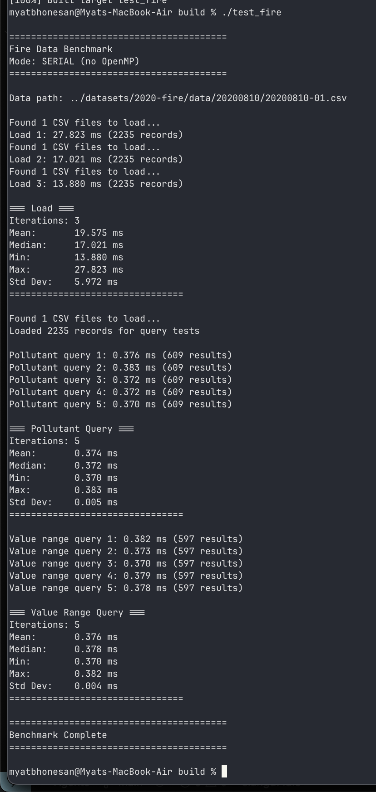

# Optimization of Data Storage and Retrieval using Parellization with OpenMP

## Setup
1. Copy the datasets folder into the main directory
2. Build and compile using CMake
```
    mkdir build && cd build
    cmake ..
    make
```
## Implemented a sample benchmark test of the 2020 fire data with CSV parsing and loading from multiple files and searching through folders recursively

### For regular data loading and retrieval comment out the line:
`#SET(OPENMP_CXX_FLAGS "-O3 -fopenmp")`

### For parallel optimization with OpenMP uncomment the line:
`SET(OPENMP_CXX_FLAGS "-O3 -fopenmp")`

### Currently implementing a parallel loop pattern during data loading and querying, using a work-sharing/data parallelism pattern.

- With max threads enabled with OpenMP



- Unoptimized with no threading


#### Stuff to add
1. Maybe trying out leader-worker and benchmarking between centralized and decentralized (using RR)
2. Push or pull (Scatter/Gather) approach?
3. Feed-back approaches?