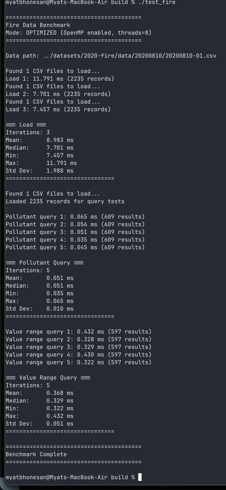
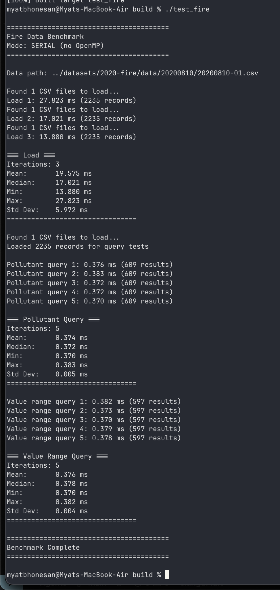

# Parallel Data Processing with OpenMP

## Project Overview
This project implements and benchmarks different parallelization strategies for loading and querying large CSV datasets. Specifically focuses on population data and fire/air quality data with multiple threading approaches.

## Parallelization Strategies Implemented
1. **Serial (Baseline)** - No parallelization
2. **OpenMP** - Data parallelism using `#pragma omp parallel for`
3. **Leader-Worker (Centralized Queue)** - All workers share a single task queue
4. **Leader-Worker (Round-Robin)** - Each worker gets its own dedicated queue

## Setup and Build

### Requirements
- C++17 compiler
- OpenMP support (for parallel versions)
- CMake 3.10+

### Building the Project
```bash
mkdir build && cd build
cmake ..
make
```

### Enabling OpenMP
To enable parallel optimization with OpenMP, uncomment this line in `CMakeLists.txt`:
```cmake
SET(CMAKE_CXX_FLAGS "${CMAKE_CXX_FLAGS} -O3 -fopenmp")
```

## Running Benchmarks

### Population Data Benchmark
```bash
./test_population <path_to_population_csv>
```

### Fire Data Benchmark
```bash
./test_fire <path_to_fire_data_directory>
```

## Performance Results

The project includes comprehensive benchmarking of all four strategies across both loading and querying operations.

### With OpenMP enabled


### Without threading (serial baseline)


## Key Features
- **CSV Parsing** - Handles quoted fields and various delimiters
- **Indexing** - Builds indexes for fast lookups by country code, pollutant type, etc.
- **Query Operations** - Range queries, geographic bounds, aggregations
- **Flexible Strategy Selection** - Can choose different strategies at runtime

## Project Structure
```
src/
  common/           - Shared utilities (CSV parser, parallel strategies)
  PopulationData/   - Population dataset implementation
  firedata/         - Fire/air quality dataset implementation
test/              - Benchmark tests
```

## Notes
- The centralized queue approach tends to work better with imbalanced workloads
- Round-robin is faster when tasks are roughly equal size
- OpenMP provides the best speedup with minimal code changes
